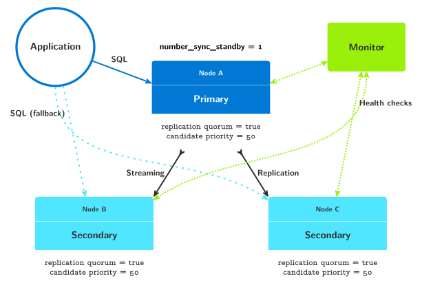

# HW13

- реализуем следующую схему с автоматическим переключением на резервную ноду в случае отказа первичной ноды в кластере PostgreSQL с помощью экстеншена и сервиса pg_auto_failover



- сбилдим pg_auto_failover c PostgreSQL 13 и запушим в docker hub - kovtalex/pg_auto_failover:pg13

> Инструкция <https://github.com/citusdata/pg_auto_failover>

- улучшим docker-compose.yaml хелсчеками и изменим некоторые параметры

[docker-compose.yaml](./docker-compose.yaml)

- запустим наши контейнеры

```bash
docker-compose up -d monitor node1 node2 node3
```

> Пока без тестового приложения app

- проверим статус контейнеров

```bash
docker-compose ps
NAME                COMMAND                  SERVICE             STATUS              PORTS
app                 "pg_autoctl do demo …"   app                 running          
monitor             "pg_autoctl create m…"   monitor             running (healthy)   
node1               "pg_autoctl create p…"   node1               running (healthy)   
node2               "pg_autoctl create p…"   node2               running (healthy)   
node3               "pg_autoctl create p…"   node3               running (healthy) 
```

- зайдем в контейнер monitor и посмотрим версии pg_auto_failover и PostgreSQL

```bash
docker exec -it monitor bash

pg_autoctl --version

pg_autoctl version 1.6.1
pg_autoctl extension version 1.6
compiled with PostgreSQL 13.3 (Debian 13.3-1.pgdg100+1) on x86_64-pc-linux-gnu, compiled by gcc (Debian 8.3.0-6) 8.3.0, 64-bit
compatible with Postgres 10, 11, 12, 13, and 14
```

- посмотрим Postgres URI (connection string)

```bash
pg_autoctl show uri
        Type |    Name | Connection String
-------------+---------+-------------------------------
     monitor | monitor | postgres://autoctl_node@monitor:5432/pg_auto_failover?sslmode=require
   formation | default | postgres://node3:5432,node2:5432,node1:5432/analytics?target_session_attrs=read-write&sslmode=require
```

- посмотрим статус нод

```bash
pg_autoctl show state
  Name |  Node |  Host:Port |       TLI: LSN |   Connection |       Current State |      Assigned State
-------+-------+------------+----------------+--------------+---------------------+--------------------
node_1 |     1 | node1:5432 |   1: 0/40000D8 |   read-write |             primary |             primary
node_2 |     2 | node2:5432 |   1: 0/40000D8 |    read-only |           secondary |           secondary
node_3 |     3 | node3:5432 |   1: 0/40000D8 |    read-only |           secondary |           secondary
```

- посмотрим события

```bash
pg_autoctl show events
                    Event Time |   Node |       Current State |      Assigned State | Comment
-------------------------------+--------+---------------------+---------------------+-----------
 2021-08-02 22:23:21.744074+00 |    0/3 |          catchingup |          catchingup | New state is reported by node 3 "node_3" (node3:5432): "catchingup"
  2021-08-02 22:23:21.77676+00 |    0/3 |          catchingup |          catchingup | Node node 3 "node_3" (node3:5432) is marked as healthy by the monitor
 2021-08-02 22:23:21.778439+00 |    0/2 |        wait_standby |          catchingup | Node node 2 "node_2" (node2:5432) is marked as healthy by the monitor
 2021-08-02 22:23:21.796134+00 |    0/2 |          catchingup |          catchingup | New state is reported by node 2 "node_2" (node2:5432): "catchingup"
 2021-08-02 22:23:21.819321+00 |    0/3 |          catchingup |           secondary | Setting goal state of node 3 "node_3" (node3:5432) to secondary after it caught up.
 2021-08-02 22:23:21.867038+00 |    0/2 |          catchingup |           secondary | Setting goal state of node 2 "node_2" (node2:5432) to secondary after it caught up.
 2021-08-02 22:23:22.039804+00 |    0/3 |           secondary |           secondary | New state is reported by node 3 "node_3" (node3:5432): "secondary"
 2021-08-02 22:23:22.062491+00 |    0/2 |           secondary |           secondary | New state is reported by node 2 "node_2" (node2:5432): "secondary"
 2021-08-02 22:23:22.078829+00 |    0/1 |        wait_primary |             primary | Setting goal state of node 1 "node_1" (node1:5432) to primary now that we have 2 healthy  secondary nodes in the quorum.
 2021-08-02 22:23:22.221358+00 |    0/1 |             primary |             primary | New state is reported by node 1 "node_1" (node1:5432): "primary"
```

- выполним безопасный switchover и посмотрим на результат

```bash
pg_autoctl perform switchover
22:25:43 2284 INFO  Waiting 60 secs for a notification with state "primary" in formation "default" and group 0
22:25:43 2284 INFO  Listening monitor notifications about state changes in formation "default" and group 0
22:25:43 2284 INFO  Following table displays times when notifications are received
    Time |   Name |  Node |  Host:Port |       Current State |      Assigned State
---------+--------+-------+------------+---------------------+--------------------
22:25:43 | node_1 |     1 | node1:5432 |             primary |            draining
22:25:43 | node_1 |     1 | node1:5432 |            draining |            draining
22:25:43 | node_1 |     1 | node1:5432 |            draining |          report_lsn
22:25:43 | node_2 |     2 | node2:5432 |           secondary |          report_lsn
22:25:43 | node_3 |     3 | node3:5432 |           secondary |          report_lsn
22:25:44 | node_1 |     1 | node1:5432 |          report_lsn |          report_lsn
22:25:49 | node_2 |     2 | node2:5432 |          report_lsn |          report_lsn
22:25:49 | node_3 |     3 | node3:5432 |          report_lsn |          report_lsn
22:25:49 | node_1 |     1 | node1:5432 |          report_lsn |          report_lsn
22:25:49 | node_2 |     2 | node2:5432 |          report_lsn |   prepare_promotion
22:25:49 | node_2 |     2 | node2:5432 |   prepare_promotion |   prepare_promotion
22:25:49 | node_2 |     2 | node2:5432 |   prepare_promotion |        wait_primary
22:25:49 | node_1 |     1 | node1:5432 |          report_lsn |      join_secondary
22:25:49 | node_3 |     3 | node3:5432 |          report_lsn |      join_secondary
22:25:49 | node_3 |     3 | node3:5432 |      join_secondary |      join_secondary
22:25:49 | node_1 |     1 | node1:5432 |      join_secondary |      join_secondary
22:25:50 | node_2 |     2 | node2:5432 |        wait_primary |        wait_primary
22:25:50 | node_1 |     1 | node1:5432 |      join_secondary |           secondary
22:25:50 | node_3 |     3 | node3:5432 |      join_secondary |           secondary
22:25:50 | node_3 |     3 | node3:5432 |           secondary |           secondary
22:25:50 | node_2 |     2 | node2:5432 |        wait_primary |             primary
22:25:50 | node_2 |     2 | node2:5432 |             primary |             primary


pg_autoctl show events
                    Event Time |   Node |       Current State |      Assigned State | Comment
-------------------------------+--------+---------------------+---------------------+-----------
 2021-08-02 22:25:49.454223+00 |    0/3 |          report_lsn |      join_secondary | Setting goal state of node 3 "node_3" (node3:5432) to join_secondary after node 2 "node_2" (node2:5432) got selected as the failover candidate.
  2021-08-02 22:25:49.65487+00 |    0/3 |      join_secondary |      join_secondary | New state is reported by node 3 "node_3" (node3:5432): "join_secondary"
 2021-08-02 22:25:49.659281+00 |    0/1 |      join_secondary |      join_secondary | New state is reported by node 1 "node_1" (node1:5432): "join_secondary"
 2021-08-02 22:25:50.518202+00 |    0/2 |        wait_primary |        wait_primary | New state is reported by node 2 "node_2" (node2:5432): "wait_primary"
 2021-08-02 22:25:50.547803+00 |    0/1 |      join_secondary |           secondary | Setting goal state of node 1 "node_1" (node1:5432) to secondary after node 2 "node_2" (node2:5432) converged to wait_primary.
 2021-08-02 22:25:50.552568+00 |    0/3 |      join_secondary |           secondary | Setting goal state of node 3 "node_3" (node3:5432) to secondary after node 2 "node_2" (node2:5432) converged to wait_primary.
  2021-08-02 22:25:50.79877+00 |    0/3 |           secondary |           secondary | New state is reported by node 3 "node_3" (node3:5432): "secondary"
 2021-08-02 22:25:50.830745+00 |    0/2 |        wait_primary |             primary | Setting goal state of node 2 "node_2" (node2:5432) to primary now that we have 1 healthy  secondary nodes in the quorum.
 2021-08-02 22:25:50.931758+00 |    0/2 |             primary |             primary | New state is reported by node 2 "node_2" (node2:5432): "primary"
 2021-08-02 22:25:51.027465+00 |    0/1 |           secondary |           secondary | New state is reported by node 1 "node_1" (node1:5432): "secondary"


pg_autoctl show state
  Name |  Node |  Host:Port |       TLI: LSN |   Connection |       Current State |      Assigned State
-------+-------+------------+----------------+--------------+---------------------+--------------------
node_1 |     1 | node1:5432 |   2: 0/4000B70 |    read-only |           secondary |           secondary
node_2 |     2 | node2:5432 |   2: 0/4000B70 |   read-write |             primary |             primary
node_3 |     3 | node3:5432 |   2: 0/4000B70 |    read-only |           secondary |           secondary
```

> сейчас первичной нодой стала node_2

- теперь запустим тестовое приложение, имитируем 2 отказ и посмотрим лог приложения

```bash
docker-compose down
docker-compose up -d 
```

```log
22:06:53 1 INFO  Using application connection string "postgres://node1:5432,node3:5432,node2:5432/analytics?target_session_attrs=read-write&sslmode=prefer"
22:06:53 1 INFO  Using Postgres user PGUSER "ad"
22:06:53 1 INFO  Preparing demo schema: drop schema if exists demo cascade
22:06:53 1 WARN  NOTICE:  schema "demo" does not exist, skipping
22:06:53 1 INFO  Preparing demo schema: create schema demo
22:06:53 1 INFO  Preparing demo schema: create table demo.tracking(ts timestamptz default now(), client integer, loop integer, retries integer, us bigint, recovery bool)
22:06:53 1 INFO  Preparing demo schema: create table demo.client(client integer, pid integer, retry_sleep_ms integer, retry_cap_ms integer, failover_count integer)
22:06:53 1 INFO  Starting 1 concurrent clients as sub-processes
22:06:53 10 INFO  Client 1 is using a retry policy with initial sleep time 1340 ms and a retry time capped at 302 ms
22:06:53 9 INFO  Failover client is started, will failover in 10s and every 30s after that
22:06:53 10 INFO  Client 1 connected 1 times in less than 7 ms, before first failover
22:07:03 9 INFO  pg_autoctl perform failover
22:07:03 9 WARN  Lost connection.
22:07:03 9 ERROR Failed to wait until a new primary has been notified
22:07:03 9 INFO  pg_autoctl perform failover
22:07:03 9 ERROR Monitor ERROR:  couldn't find the primary node in formation "default", group 0
22:07:03 9 ERROR SQL query: SELECT pgautofailover.perform_failover($1, $2)
22:07:03 9 ERROR SQL params: 'default', '0'
22:07:03 9 ERROR Failed to perform failover for formation default and group 0
22:07:03 9 FATAL Failed to perform failover/switchover, see above for details
22:07:03 10 WARN  Failed to connect to "postgres://@node1,node3,node2:5432,5432,5432/analytics?sslmode=prefer&target_session_attrs=read-write", retrying until the server is ready
22:07:03 10 WARN  Failed to connect after successful ping
22:07:04 10 INFO  Successfully connected to "postgres://@node1,node3,node2:5432,5432,5432/analytics?sslmode=prefer&target_session_attrs=read-write" after 5 attempts in 1432 ms.
22:07:04 10 INFO  Client 1 attempted to connect during a failover, and had to attempt 5 times which took 1432.228 ms with the current retry policy
22:07:04 10 INFO  Client 1 connected 108 times in less than 33 ms, after 1 failover(s)
22:07:05 10 WARN  Failed to connect to "postgres://@node1,node3,node2:5432,5432,5432/analytics?sslmode=prefer&target_session_attrs=read-write", retrying until the server is ready
22:07:05 10 INFO  Successfully connected to "postgres://@node1,node3,node2:5432,5432,5432/analytics?sslmode=prefer&target_session_attrs=read-write" after 2 attempts in 354 ms.
22:07:05 10 INFO  Client 1 attempted to connect during a failover, and had to attempt 2 times which took 355.066 ms with the current retry policy
22:07:14 10 INFO  Client 1 connected 167 times in less than 52 ms, after 2 failover(s)
22:07:24 10 INFO  Client 1 connected 245 times in less than 52 ms, after 2 failover(s)
22:07:34 10 INFO  Client 1 connected 319 times in less than 52 ms, after 2 failover(s)
22:07:44 10 INFO  Client 1 connected 389 times in less than 52 ms, after 2 failover(s)
22:07:54 10 INFO  Client 1 connected 469 times in less than 72 ms, after 2 failover(s)
22:08:04 10 INFO  Client 1 connected 524 times in less than 72 ms, after 2 failover(s)
22:08:14 10 INFO  Client 1 connected 590 times in less than 72 ms, after 2 failover(s)
22:08:24 10 INFO  Client 1 connected 666 times in less than 72 ms, after 2 failover(s)
22:08:34 10 INFO  Client 1 connected 734 times in less than 72 ms, after 2 failover(s)
22:08:44 10 INFO  Client 1 connected 799 times in less than 72 ms, after 2 failover(s)
22:08:54 10 INFO  Client 1 connected 872 times in less than 72 ms, after 2 failover(s)
22:09:04 10 INFO  Client 1 connected 950 times in less than 72 ms, after 2 failover(s)
22:09:14 10 INFO  Client 1 connected 1011 times in less than 72 ms, after 2 failover(s)
22:09:24 10 INFO  Client 1 connected 1078 times in less than 72 ms, after 2 failover(s)
22:09:34 10 INFO  Client 1 connected 1159 times in less than 72 ms, after 2 failover(s)
22:09:44 10 INFO  Client 1 connected 1223 times in less than 72 ms, after 2 failover(s)
22:09:54 10 INFO  Client 1 connected 1289 times in less than 99 ms, after 2 failover(s)
22:10:04 10 INFO  Client 1 connected 1366 times in less than 99 ms, after 2 failover(s)
22:10:14 10 INFO  Client 1 connected on first attempt 1432 times with a maximum connection time of 99 ms
22:10:14 10 INFO  Client 1 is using a retry policy with initial sleep time 1340 ms and a retry time capped at 302 ms
22:10:14 10 INFO  Client 1 attempted to connect during a failover 2 times with a maximum connection time of 1432 ms and a total number of 7 retries
22:10:14 1 ERROR Failed to get terminal width: Inappropriate ioctl for device
 Min Connect Time (ms) |   max    | freq |                                                 bar                                                 
-----------------------+----------+------+-----------------------------------------------------------------------------------------------------
                 7.118 |   72.156 | 1431 | ▒▒▒▒▒▒▒▒▒▒▒▒▒▒▒▒▒▒▒▒▒▒▒▒▒▒▒▒▒▒▒▒▒
                99.918 |   99.918 |    1 | 
               355.066 |  355.066 |    1 | 
              1432.228 | 1432.228 |    1 | 
(4 rows)
```

> Failover происходит на 10 секунде после старта приложения и далее оно успешно переподключается.  
>
