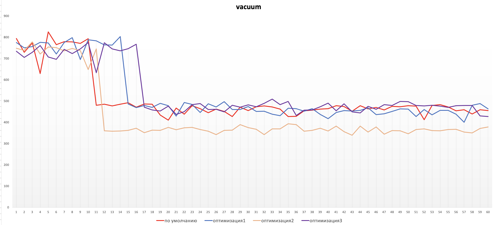

# HW5

- создаем GCE инстанс типа e2-medium и SSD 10GB

```bash
gcloud beta compute instances create postgres-hw5 \
--machine-type=e2-medium \
--image-family ubuntu-2004-lts \
--image-project=ubuntu-os-cloud \
--boot-disk-size=10GB \
--boot-disk-type=pd-ssd \
--tags=postgres \
--restart-on-failure
```

- подключаемся к VM и устанавливаем Postgres 13 с дефолтными настройками

```bash
sudo sh -c 'echo "deb http://apt.postgresql.org/pub/repos/apt $(lsb_release -cs)-pgdg main" > /etc/apt/sources.list.d/pgdg.list'
wget --quiet -O - https://www.postgresql.org/media/keys/ACCC4CF8.asc | sudo apt-key add -
sudo apt-get update
sudo apt-get -y install postgresql
```

```bash
sudo -u postgres psql
```

- применяем параметры настройки PostgreSQL из прикрепленного к материалам занятия файла

/etc/postgresql/13/main/postgresql.conf

```bash
max_connections = 40
shared_buffers = 1GB
effective_cache_size = 3GB
maintenance_work_mem = 512MB
checkpoint_completion_target = 0.9
wal_buffers = 16MB
default_statistics_target = 500
random_page_cost = 4
effective_io_concurrency = 2
work_mem = 6553kB
min_wal_size = 4GB
max_wal_size = 16GB
```

- перезагружаем кластер

```bash
sudo pg_ctlcluster 13 main restart
```

- выполняем pgbench -i postgres

```bash
sudo -u postgres pgbench -i postgres

dropping old tables...
creating tables...
generating data (client-side)...
100000 of 100000 tuples (100%) done (elapsed 0.09 s, remaining 0.00 s)
vacuuming...
creating primary keys...
done in 0.43 s (drop tables 0.01 s, create tables 0.01 s, client-side generate 0.26 s, vacuum 0.09 s, primary keys 0.07 s).
```

- запустим pgbench -c8 -P 5 -T 1200 -U postgres postgres и получим данные с параметрами вакуума по умолчанию

```bash
sudo -u postgres pgbench -c8 -P 5 -T 1200 -U postgres postgres
```

- дадим отработать до конца и зафиксируем среднее значение tps в последней ⅙ части работы

- а дальше настроим autovacuum, так чтобы получить максимально ровное значение tps на горизонте 20 минут (график - по умолчанию)

```bash
vacuum_cost_delay = 0
vacuum_cost_page_hit = 0
vacuum_cost_page_miss = 5
vacuum_cost_page_dirty = 5
vacuum_cost_limit = 200

autovacuum_max_workers = 10
autovacuum_naptime = 1s
autovacuum_vacuum_threshold = 50
autovacuum_analyze_threshold = 50
autovacuum_vacuum_scale_factor = 0.05
autovacuum_analyze_scale_factor = 0.05
autovacuum_vacuum_cost_delay = 5ms
autovacuum_vacuum_cost_limit = -1
```

> данные параметры были подчерпнуты из [статьи](https://habr.com/ru/post/501516/) по оптимальной настройке автовакуума для SSD дисков (график - оптимизация1)

- продолжаем крутить параметры для более агрессивной работы автовакуума добиваясь максимальной оптимизации, при этом стадает tps (график - оптимизация2)

```bash
vacuum_cost_delay = 0
vacuum_cost_page_hit = 0
vacuum_cost_page_miss = 1
vacuum_cost_page_dirty = 1
vacuum_cost_limit = 200

autovacuum_max_workers = 1
autovacuum_naptime = 1s
autovacuum_vacuum_threshold = 10
autovacuum_vacuum_scale_factor = 0
autovacuum_vacuum_cost_delay = -1
autovacuum_vacuum_cost_limit = -1
```

- ослабим настройки автовакуума (график - оптимизация3)



Параметр | Значение | Описание
-------- | -------- | --------
vacuum_cost_delay | 0 | интервал паузы между формированиями пачки страниц за одну итерацию обработки
vacuum_cost_page_hit | 0 | количество очков, начисляемых за обработку страниц в share buffers, т.к. эти страницы уже в памяти и нет нагрузки на диск
vacuum_cost_page_miss | 5 | количество очков, начисляемых за обработку страниц после чтения с диска или в page cache
vacuum_cost_page_dirty | 5 | количество очков, начисляемых за обработку страниц, которые содержат данные, но еще не синхронизированны с диском и требуется предварительная запись на диск
vacuum_cost_limit | 300 | суммарное значение количества очков, которые начисляются за обработку страниц перед паузой
autovacuum_max_workers | 10 | количество воркеров, оптимальное значение 10-15% от общего количества процессорных ядер (по идее для нашего стенда необходимо указывая 1 воркер, но это не дает должного влияния на производительность)
autovacuum_naptime | 1s | минимальная задержка между запусками воркеров автовакуума
autovacuum_vacuum_threshold | 50 | минимальное число добавленных, изменённых или удалённых строк, при котором будет выполняться вакуум для отдельно взятой таблицы
autovacuum_vacuum_scale_factor | 0.05 | процент от размера таблицы, который будет добавляться к autovacuum_vacuum_threshold при выборе порога срабатывания
autovacuum_vacuum_cost_delay | 5ms | делится между активными воркерами, которые запущены и выполняют обработку
autovacuum_vacuum_cost_limit | -1 | делится между активными воркерами, которые запущены и выполняют обработку, -1 подставляется значение  vacuum_cost_limit
