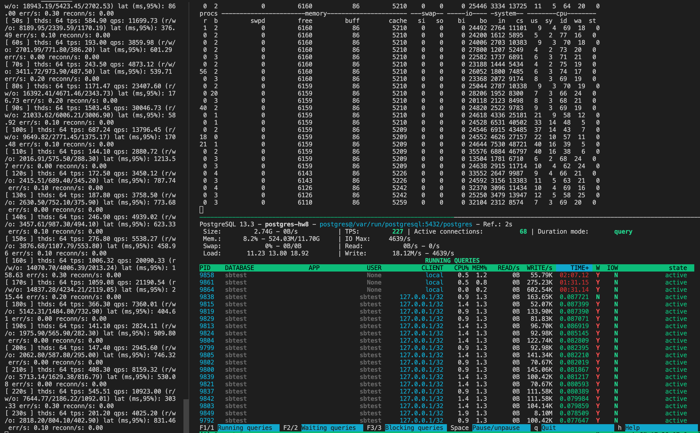
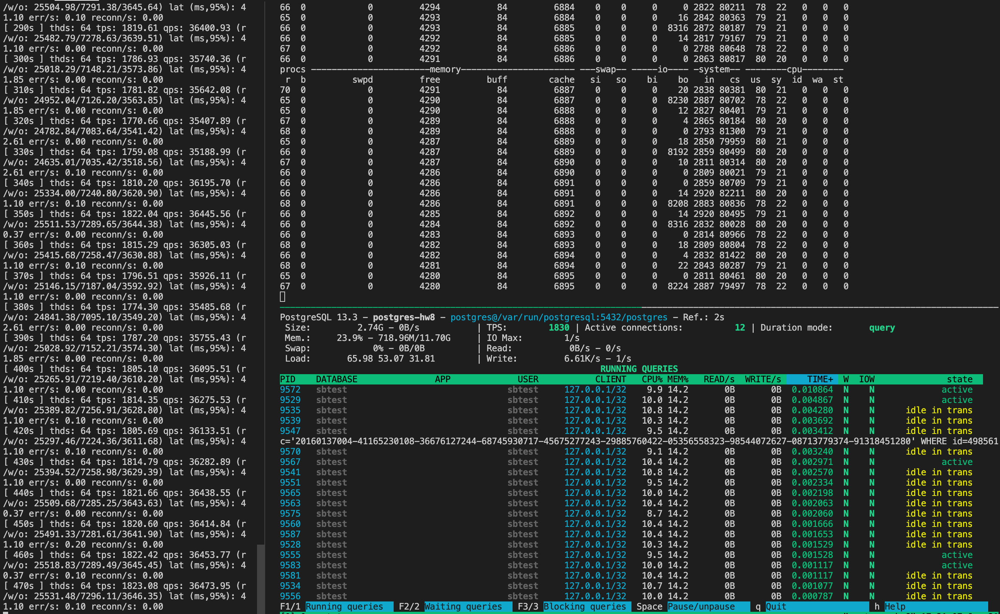
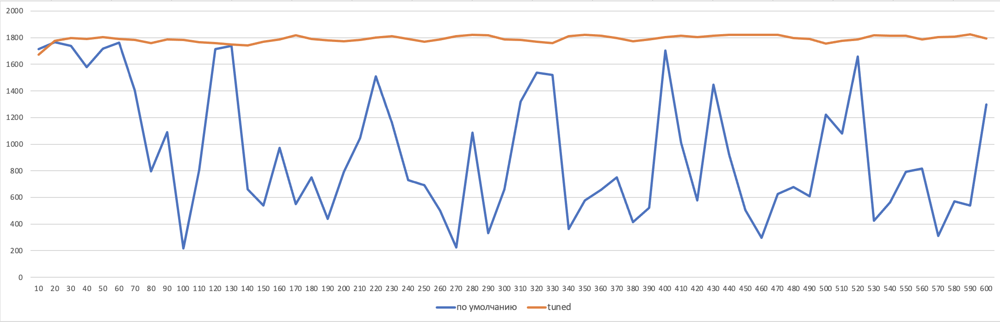

# HW8

- создаем GCE инстанс

```bash
gcloud beta compute instances create postgres-hw8 \
--machine-type=custom-8-12288 \
--image-family ubuntu-2004-lts \
--image-project=ubuntu-os-cloud \
--boot-disk-size=10GB \
--boot-disk-type=pd-ssd \
--tags=postgres \
--restart-on-failure
```

- подключаемся к VM и устанавливаем Postgres 13 с дефолтными настройками

```bash
sudo sh -c 'echo "deb http://apt.postgresql.org/pub/repos/apt $(lsb_release -cs)-pgdg main" > /etc/apt/sources.list.d/pgdg.list'
wget --quiet -O - https://www.postgresql.org/media/keys/ACCC4CF8.asc | sudo apt-key add -
sudo apt-get update
sudo apt-get -y install postgresql
```

- устанавливаем sysbench для тестирования нагрузки базы данных

```bash
curl -s https://packagecloud.io/install/repositories/akopytov/sysbench/script.deb.sh | sudo bash
sudo apt -y install sysbench
```

- редактируем /etc/postgresql/13/main/pg_hba.conf добавляя

```bash
host    sbtest          sbtest          127.0.0.1/32            md5
```

- перезапускаем кластер

```bash
sudo pg_ctlcluster 13 main restart
```

- подключаемся к БД

```bash
sudo -u postgres psql
```

- и подготавливаем базу для нашего теста

```sql
CREATE USER sbtest WITH PASSWORD 'password';
CREATE DATABASE sbtest;
GRANT ALL PRIVILEGES ON DATABASE sbtest TO sbtest;
```

- инициализируем БД используя sysbench

```bash
sudo sysbench \
 --db-driver=pgsql \
 --oltp-table-size=1000000 \
 --oltp-tables-count=10 \
 --threads=1 \
 --pgsql-host=127.0.0.1 \
 --pgsql-port=5432 \
 --pgsql-user=sbtest \
 --pgsql-password=password \
 --pgsql-db=sbtest \
 /usr/share/sysbench/tests/include/oltp_legacy/parallel_prepare.lua \
 run
```

> Приведенная выше команда генерирует 1 000 000 строк на таблицу для 10 таблиц (от sbtest1 до sbtest10) внутри базы данных sbtest. Имя схемы - "public", которое используется по умолчанию. Данные подготавливаются сценарием с именем parallel_prepare.lua, который доступен в /usr/share/sysbench/tests/include/oltp_legacy

```bash
psql -U sbtest -h 127.0.0.1 -p 5432 -W -c '\dt+\'

                           List of relations
 Schema |   Name   | Type  | Owner  | Persistence |  Size  | Description 
--------+----------+-------+--------+-------------+--------+-------------
 public | sbtest1  | table | sbtest | permanent   | 211 MB | 
 public | sbtest10 | table | sbtest | permanent   | 211 MB | 
 public | sbtest2  | table | sbtest | permanent   | 211 MB | 
 public | sbtest3  | table | sbtest | permanent   | 211 MB | 
 public | sbtest4  | table | sbtest | permanent   | 211 MB | 
 public | sbtest5  | table | sbtest | permanent   | 211 MB | 
 public | sbtest6  | table | sbtest | permanent   | 211 MB | 
 public | sbtest7  | table | sbtest | permanent   | 211 MB | 
 public | sbtest8  | table | sbtest | permanent   | 211 MB | 
 public | sbtest9  | table | sbtest | permanent   | 211 MB | 
(10 rows)
```

- read/write тестирование нагрузки

```bash
sysbench \
--db-driver=pgsql \
--report-interval=10 \
--oltp-table-size=1000000 \
--oltp-tables-count=10 \
--threads=64 \
--time=600 \
--pgsql-host=127.0.0.1 \
--pgsql-port=5432 \
--pgsql-user=sbtest \
--pgsql-password=password \
--pgsql-db=sbtest \
/usr/share/sysbench/tests/include/oltp_legacy/oltp.lua \
run
```

> Приведенная выше команда генерирует рабочую нагрузку OLTP из сценария LUA, называемого /usr/share/sysbench/tests/include/oltp_legacy/oltp.lua, для 1 000 000 строк из 10 таблиц с 64 worker threads в течение 5 минут на хосте 127.0.0.1. Каждые 10 секунды sysbench будет сообщать промежуточную статистику (--report-interval = 2)

Итого при дефолтных настройках имеем большой разброс tps от 215 до 1702, задержки операций ввода-вывода и вследствии чего неполную нагрузку на CPU



- улучшим работу нашего сервера

```bash
shared_buffers = 4892MB
synchronous_commit = off
fsync = off
full_page_writes = off
effective_cache_size = 7GB
checkpoint_timeout = 1h
max_wal_size = 2GB
maintenance_work_mem = 100MB
work_mem = 50MB
max_connections = 80
```



> Мы избавились от задержек связанных с обращением к диску и теперь наш tps стабилен, что можно увидеть на графике ниже

Название параметра | Значение | Описание
--- | --- | ---
max_connections | 80 | Установим значение чуть больше количества подключений генерируемых sysbench
shared_buffers | 4892MB | Установим 25% от общей оперативной памяти на сервере
work_mem | 50MB | Можно брать 2–4% от доступной памяти. Для веб-приложений обычно устанавливают низкие значения work_mem, так как запросов обычно много, но они простые, обычно хватает от 512 до 2048KB. Мы установим 50MB, так как нам позволяет память
maintenance_work_mem | 100MB | Неплохо бы устанавливать значение от 50 до 75% размера нашей самой большой таблицы или индекса. Так как наши таблицы размером 211MB, то установим 100MB
effective_cache_size | 7GB | На выделенном сервере имеет смысл выставлять effective_cache_size в 2/3 от всей оперативной памяти
checkpoint_timeout | 1h | Увеличим время сбрасывания данных на диск при проходе контрольной точки для уменьшения частого обращения к диску
max_wal_size | 2GB | Тоже самое по размеру, до которого может вырастать WAL
synchronous_commit | off | Дает большой прирост скорости записи, но жертвуем надежностью
fsync | off | Дает большой прирост скорости записи, но жертвуем надежностью
full_page_writes | off | Установливается в **off**, если fsync **off**


